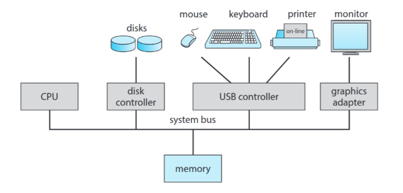

# 01 How Computer Work

## The first introduction

- PC？ (when the computer is turned on)
- X86, Solid mode, CS<<4+IP
- Set CS=OxFFFF, IP=Ox0000→0xFFFFO(Rom Bios)
- Check RAM, keyboard, display, disk......
- Read the contents of track 0 and sector 0 on the disk into
- memory(0x7c00)
- Set CS=0x07c0, IP=0x0000
- The story of os begin.....

### 最初的引导程序

文件名为 `bootsect.s`，使用汇编语言编写。

#### Operating systems defination

- No universally accepted definition
- "Everything a vendor ships when you order an operating system" is a good approximation
  - But varies wildly
- "The one program running at all times on the computer" is the kernel.
- Everything else is either
  - a system program (ships with the operating system)
  - or an application program.

## Computer-System Organization

现代通用计算机系统由一个或多个 CPU 和多个设备控制器通过公共总线连接，提供组件和共享内存之间的访问。每个设备控制器负责一个特定类型的设备(例如,磁盘驱动器、音频设备或图形显示器)。根据控制器的不同，可以连接多个设备。例如，一个系统的 USB 端口可以连接到一个 USB 集线器，多个设备可以连接到 USB 集线器。设备控制器维护一些本地缓冲存储和一组专用寄存器。设备控制器负责在其控制的外围设备和本地缓冲存储之间移动数据。

### 系统中断

概述硬件可以通过向 CPU 发送信号来随时触发中断，通常是通过系统总线的方式。（计算机系统内部可能存在多条总线,但系统总线是各主要部件之间通信的主要通路。）中断也用于许多其他目的，是操作系统和硬件交互的关键部分。当 CPU 中断时，它停止它正在做的事情，并立即将执行转移到一个固定的位置。
