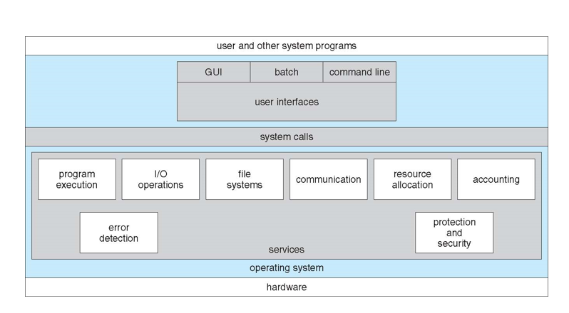
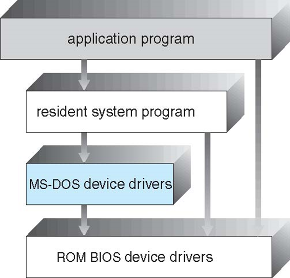
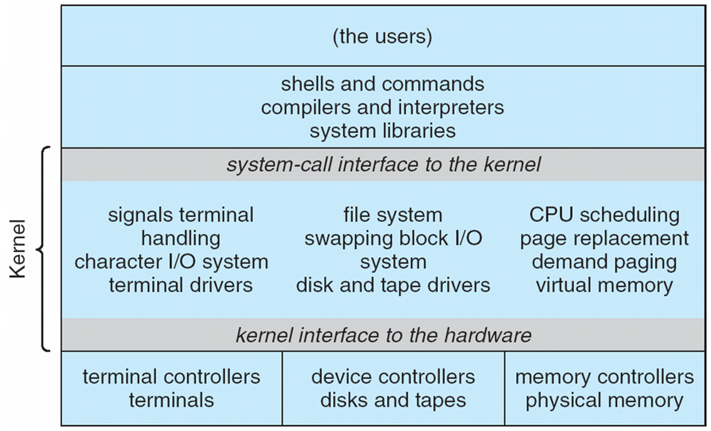
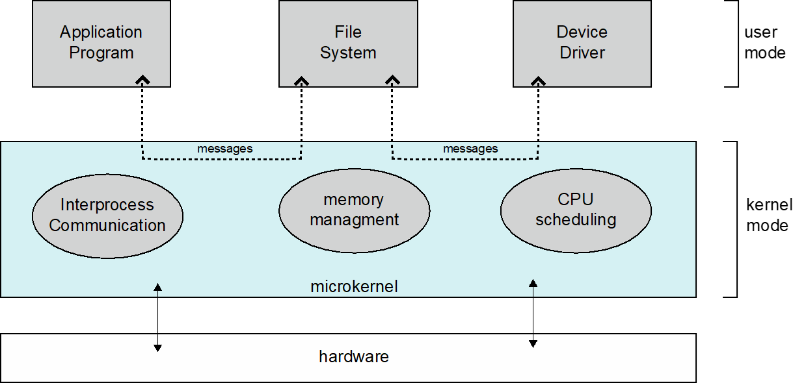

# 02 Operating-System Structures

## Contents

- Operating System Services
- User Operating System Interface
- System Calls
- Types of System Calls
- System Programs
- Operating System Design and Implementation
- Operating System Structure
- Operating System Debugging
- Operating System Generation
- System Boot

### Objectives

- 描述操作系统为用户、进程和其他系统提供的服务
- 讨论构建操作系统的各种方法
- 解释如何安装和定制操作系统，以及如何启动操作系统

## Operating System Services

Operating systems provide an environment for execution of programs and services to programs and users 操作系统为程序和用户提供执行程序和服务的环境

One set of operating-system services provides functions that are helpful to the user: 一组操作系统服务提供了对用户有帮助的功能：

- **User interface** - Almost all operating systems have a user interface (**UI**). Varies between **Command-Line (CLI)**, **Graphics User Interface (GUI)**, **Batch.** 几乎所有操作系统都有用户界面（**UI**）。在**命令行（CLI）**、**图形用户界面（GUI）**、**批处理**之间变化。
- **Program execution 程序执行** - The system must be able to load a program into memory and to run that program, end execution, either normally or abnormally (indicating error). 系统必须能够将程序加载到内存中，并正常或异常（显示错误）运行程序，结束执行。
- **I/O operations** - A running program may require I/O, which may involve a file or an I/O device.
- **File-system manipulation 文件系统操作** - The file system is of particular interest. Programs need to read and write files and directories, create and delete them, search them, list file Information, permission management. 文件系统特别重要。程序需要读取和写入文件和目录、创建和删除它们、搜索它们、列出文件信息和权限管理。
- **Communications 通信** - Processes may exchange information, on the same computer or between computers over a network. 进程可以在同一台计算机上或通过网络在计算机之间交换信息。通信可以通过共享内存或通过操作系统传递消息（数据包）进行。
- **Error detection 错误检测** - OS needs to be constantly aware of possible errors. 操作系统需要不断地注意可能存在的错误。
  - 错误可能出现在 CPU 和内存硬件、I/O 设备、用户程序中。
  - 对于每种类型的错误，操作系统都应采取适当的措施，以确保正确和一致的计算。
  - 调试工具可以极大地增强用户和程序员使用系统的能力。

**A View of Operating System Services：**

## **User Operating System Interface**

- CLI or **command interpreter** allows direct command entry.
- GUI bring ser-friendly **desktop** metaphor interface.

Many systems now include both CLI and GUI interfaces.

## System Calls

- Programming interface to the services provided by the OS 操作系统提供的服务的编程接口
- Typically written in a high-level language (C or C++) 通常用高级语言（如 C 或 C++）编写
- Mostly accessed by programs via a high-level **Application Programming Interface (API)** rather than direct system call use 大多数情况下，程序通过高级 **应用程序编程接口（API）** 访问，而不是直接使用系统调用
- Three most common APIs are Win32 API for Windows, POSIX API for POSIX-based systems (including virtually all versions of UNIX, Linux, and Mac OS X), and Java API for the Java virtual machine (JVM) 三个最常见的 API 是 Windows 的 Win32 API，基于 POSIX 的系统的 POSIX API（包括几乎所有版本的 UNIX、Linux 和 Mac OS X），以及 Java 虚拟机（JVM）的 Java API

### System Call Parameter Passing

向操作系统传递参数的三种一般方法：

- 最简单：在寄存器中传递参数 在某些情况下，参数可能比寄存器还多
- 参数存储在内存中的块或表中，块的地址作为寄存器中的参数传递（Linux 和 Solaris 采用这种方法）
- 参数由程序放置或推入堆栈，由操作系统从堆栈中弹出
- 块和堆栈方法不限制传递参数的数量或长度

## Types of System Calls

Process control 过程控制:

- create process, terminate process
- end, abort
- load, execute
- get process attributes, set process attributes
- wait for time
- wait event, signal event
- allocate and free memory
- Dump memory if error
- **Debugger** for determining **bugs, single step** execution
- **Locks** for managing access to shared data between processes

File management 文件管理:

- create file, delete file
- open, close file
- read, write, reposition
- get and set file attributes

Device management 设备管理:

- request device, release device
- read, write, reposition
- get device attributes, set device attributes
- logically attach or detach devices

Information maintenance 信息维护:

- get time or date, set time or date
- get system data, set system data
- get and set process, file, or device attributes

Communications 通信:

- create, delete communication connection
- send, receive messages if message passing model to host name or process name
- from client to server
- shared-memory model create and gain access to memory regions
- transfer status information
- attach and detach remote devices

Protection 防护:

- Control access to resources
- Get and set permissions
- Allow and deny user access

## System Programs

System programs provide a convenient environment for program development and execution. They can be divided into:

- File manipulation (文件操作)
- Status information sometimes stored in a file modification (状态信息有时存储在文件修改中)
- Programming language support (编程语言支持)
- Program loading and execution (程序加载和执行)
- Communications (通信)
- Background services (后台服务)
- Application programs (应用程序)

Most users' interaction with the operating system is through system programs rather than actual system calls.

## Operating System Structure

### Simple Structure — MS-DOS

MS-DOS – written to provide the most functionality in the least space. 旨在以最小的空间提供最多的功能。

- Not divided into modules
- Although MS-DOS has some structure, its interfaces and levels of functionality are not well separated.

### Non Simple Structure — UNIX

UNIX – limited by hardware functionality, the original UNIX operating system had limited structuring. 由于硬件功能的限制，最初的 UNIX 操作系统的结构有限。

The UNIX OS consists of two separable parts:

- Systems programs
- The kernel

The kernel is consisting of everything below the system-call interface and above the physical hardware. And it provides the file system, CPU scheduling, memory management, and other operating-system functions; a large number of functions for one level. 内核由系统调用接口以下和物理硬件之上的所有内容组成。 并提供文件系统、CPU 调度、内存管理等操作系统功能； 一个级别有大量功能。

### Traditional UNIX System Structure

Beyond simple but not fully layered:

### Microkernel System Structure

- Moves as much from the kernel into user space. 从内核转为用户空间
- Mach example of microkernel.
  > Mac OS X kernel (Darwin) partly based on Mach.
- Communication takes place between user modules using message passing. 用户与模块之间使用消息传递进行通信。

Benefits:

- Easier to extend a microkernel.
- Easier to port the operating system to new architectures. 更容易将操作系统移植到新体系结构。
- More reliable (less code is running in kernel mode).
- More secure.

Detriments 缺点:

- Performance overhead of user space to kernel space communication. 用户空间到内核空间通信的性能开销。

### Hybrid Systems

Most modern operating systems are actually not one pure model

## Operating-System Debugging

- Debugging is finding and fixing errors, or bugs.
- OS generates log files 日志文件 containing error information.
- Failure of an application can generate a core dump file capturing the memory of the process. 应用程序失败会生成一个捕获进程内存的核心转储文件。
- Operating system failure can generate a crash dump file containing kernel memory 包含内核内存的故障转储文件.
- Beyond crashes, performance tuning can optimize system performance.
  - Sometimes using trace listings of activities, recorded for analysis. 有时使用记录的活动跟踪列表以供分析。
  - Profiling is periodic sampling of the instruction pointer to look for statistical trends. 分析是对指令指针进行定期采样以查找统计趋势。

> **DTrace**
>
> tool in Solaris, FreeBSD, Mac OS X allows live instrumentation on production systems.
>
> Probes fire when code is executed within a provider, capturing state data and sending it to consumers of those probes. 当代码在提供者中执行时，探针会触发，捕获状态数据并将其发送给这些探针的使用者。

## Operating System Generation

Operating systems are designed to run on any of a class of machines; the system must be configured for each specific computer site. 操作系统被设计成在任何一类机器上运行；必须为每个特定计算机站点配置系统。

### System Boot

- When power is initialized on the system, execution starts at a fixed memory location 从一个固定的内存位置开始执行代码.
- Firmware 固件 ROM is used to hold the initial boot code.
- The operating system must be made available to hardware 必须可供硬件使用 so that the hardware can start it.
- A small piece of code, called a bootstrap loader, is stored in ROM or EEPROM. It locates the kernel 定位内核, loads it into memory, and starts it.
- Sometimes it is a two-step process where a boot block at a fixed location is loaded by ROM code, which then loads the bootstrap loader from the disk 其中固定位置的引导块由 ROM 代码加载，然后从磁盘加载引导加载程序.
- A common bootstrap loader 常见的引导加载程序, GRUB, allows the selection of a kernel from multiple disks, versions, and kernel options.
- The kernel loads, and the system is then running.
