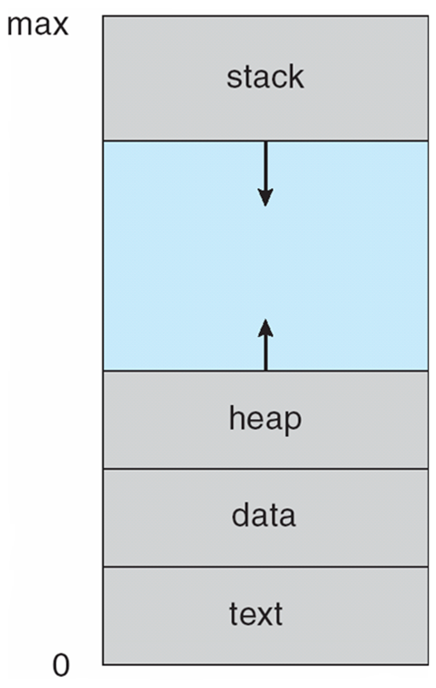
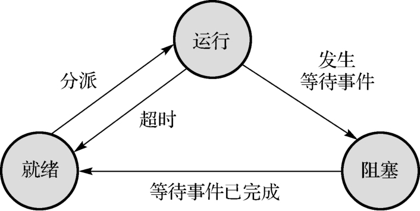
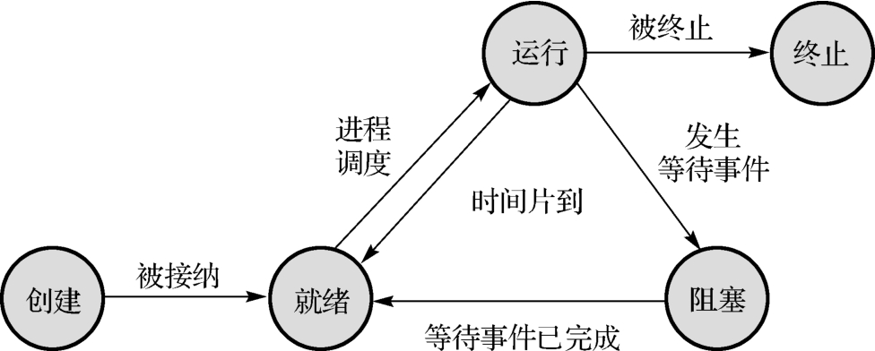
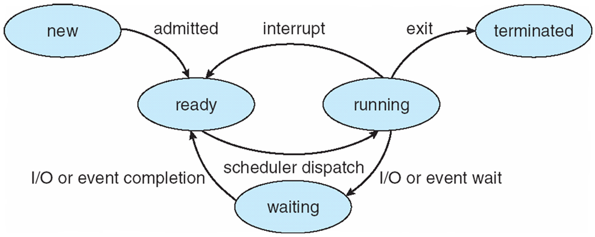
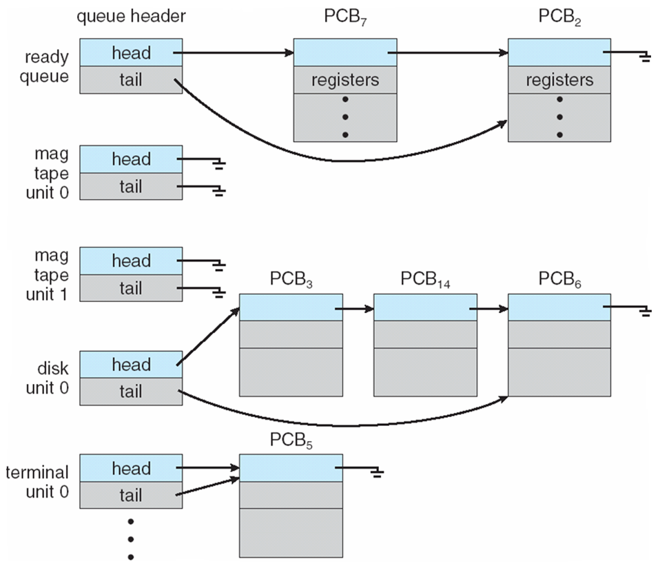
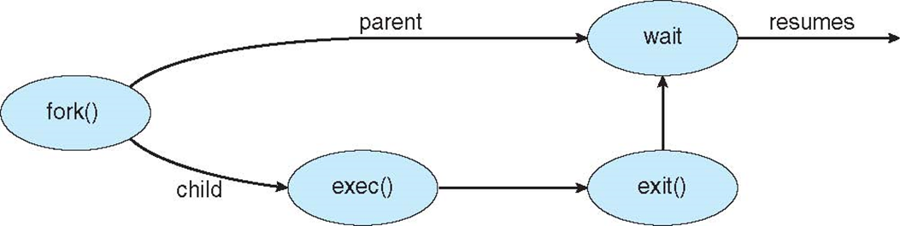
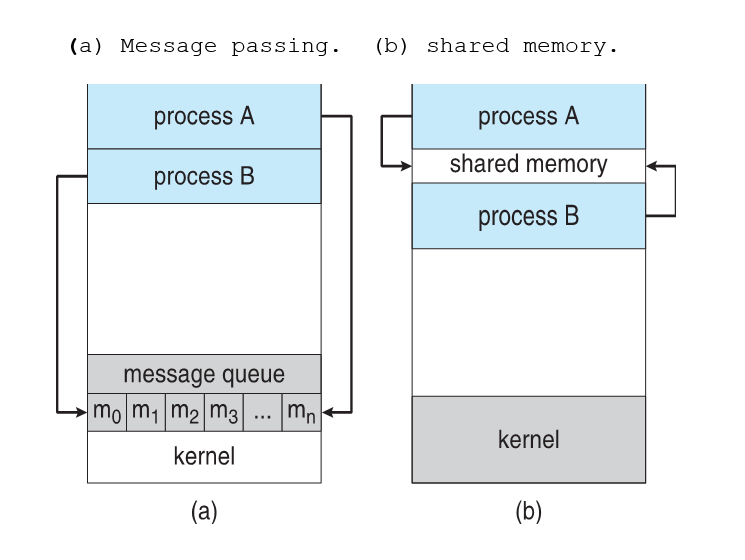

# 03 Processes

## Contents

- Process Concept
- Process Scheduling
- Operations on Processes
- Interposess Communication
- Examples of IPC Systems
- Communication in Client-Server Systems

### Objectives

- To introduce the notion of a process -- a program in execution, which forms the basis of all computation.
- To describe the various features of processes, including scheduling, creation and termination, and communication.
- To explore interposes communication using shared memory and message passing.
- To describe communication in client-server systems.

## Process Concept

> 最简单的模型是基于这样一个事实上，进程要么正在执行，要么没有执行。这样，一个进程就有两种状态：运行（Running）和非运行（Not-running）。
>
> 尽管这个模型很简单，但已经显示出操作系统设计的一些复杂性了。每个进程必须以某种方式来标识，以便操作系统能够对其进行跟踪。也就是说，必须有一些与进程相关的信息，包括进程的当前状态以及进程实体在内存中的地址等。那些非运行状态的进程存放在一个排序队列中等待分派程序的调度运行。

An operating system executes a variety of programs:

- Batch system 批处理系统 – jobs
- Time-shared systems 分时系统 – user programs or tasks

进程：执行中的程序；流程执行必须以顺序方式进行。

Program is passive entity stored on disk (executable file), process is active. 程序是存储在磁盘上的被动实体（可执行文件），进程是主动的。

Program becomes process when executable file loaded into memory. 当可执行文件加载到内存中时，程序就变成了进程。

Execution of program started via GUI mouse clicks, command line entry of its name, etc. 通过 GUI 鼠标点击、命令行输入其名称等启动程序执行。

One program can be several processes. Consider multiple users executing the same program. 一个程序可以是多个进程。考虑多个用户执行同一个程序。



### Process State

> 当正在执行的进程中断执行时，就被放入进程队列等待下一次运行。如果进程结束或运行失败，它就会被注销而退出系统。无论哪种情况出现，分派程序都会选择一个新的非运行状态进程投入运行。
>
> 但分派程序不能只是在进程队列中选择等待时间最长的进程，而是应该扫描整个进程队列寻找未被阻塞且等待时间最长的进程。因此自然而然是将非运行状态又分为两种状态：就绪（Ready）和阻塞（Blocked）。
>
> 
>
> 这样，运行中的进程就具有了三种基本状态：运行、阻塞和就绪。这三种状态构成了最简单的进程生命周期模型。进程在其生命周期内处于这三种状态之一，其状态将随着自身的推进和外界环境的变化而发生改变，即由一种状态变迁到另一种状态。
>
> 1.  运行状态。进程获得了 CPU 和其他所需要的资源，目前正在 CPU 上运行。对单 CPU 系统而言，只能有一个进程处于运行状态。
> 2.  阻塞状态。进程运行中发生了某种等待事件（如发生了等待 I/O 的操作）而暂时不能运行的状态。处于该状态的进程不能去竞争 CPU，因为此时即使把 CPU 分配给它也无法运行。处于阻塞状态的进程可以有多个。
> 3.  就绪状态。进程获得了除 CPU 之外的所需资源，一旦得到 CPU 就可以立即投入运行。不能运行的原因还是因为 CPU 资源太少，只能等待分配 CPU 资源。在系统中处于就绪状态的进程可能有多个，通常是将它们组成一个进程就绪队列。
>
> 此后，我们将用功能更加完善的进程调度程序取代分派程序， “超时”通常也用“时间片到”取代。对上图来说，进程状态变迁应注意以下 5 点。
>
> 1.  进程由就绪状态变迁到运行状态是由进程调度程序（分派程序）完成的。也就是说，一旦 CPU 空闲，进程调度程序就立即依据某种调度算法从进程就绪队列中选择一个进程占用 CPU 运行。
> 2.  进程由运行状态变迁到阻塞状态，通常是由运行进程自身提出的。当运行进程申请某种资源得不到满足时（发生等待事件），就主动放弃 CPU 而进入阻塞状态并插入到进程阻塞队列中。这时，进程调度程序就立即将 CPU 分配给另一个就绪进程运行。
> 3.  进程由阻塞状态变迁为就绪状态总是由外界事件引起的。因为处于阻塞状态的进程没有任何活动能力，所以也无法改变自身的状态。通常是当阻塞状态进程被阻塞的原因得到解除时（等待事件已完成），由当前正在运行的进程来响应这个外界事件的请求，唤醒相应的阻塞状态进程，将其转换为就绪状态并插入到进程就绪队列中，然后该运行进程继续完成自身的任务。
> 4.  进程由运行状态变迁为就绪状态通常在分时操作系统中出现，即系统分配给运行进程所使用的 CPU 时间片用完，这时进程调度程序将 CPU 轮转给下一个就绪进程使用，由于被取消 CPU 使用权的进程仅仅是没有了 CPU，而其他所需资源并不缺少，即满足就绪状态的条件，因此转为就绪状态并插入到进程就绪队列中。
> 5.  进程不能由阻塞状态直接变迁到运行状态。由于阻塞进程阻塞的原因被解除（即等待事件已完成）后就满足了就绪状态的条件，因此将该阻塞进程由进程阻塞队列移至进程就绪队列，并将其状态改为就绪。
>
> 此外还要注意的是，虽然进程有三个基本状态，但对每个进程而言，其生命期内不一定都要经历这三个状态。对于一些计算性的简单进程，运行很短的时间就结束了，也就无须进入阻塞状态，所以个别进程可以不经历阻塞状态。

As a process executes, it changes state.

- new: The process is being created.
- running: Instructions are being executed.
- waiting: The process is waiting for some event to occur. 当程序等待输入/输出时，cpu 没有给该进程分配核，此时程序处于阻塞状态。
- ready: The process is waiting to be assigned to a processor.

  当新创建进程的初始化工作完成后，系统将其状态转变为就绪状态，并将其插入到进程就绪队列中。

- terminated: The process has finished execution. 当一个程序不再执行时，它会先仍然在内存中，等待父进程回收或其他程序处理。





dispatch 为分派程序。

在操作系统总，我们使用队列存储程序状态和对应调度接口。new 状态和 ready 状态的都是如此。

需要注意，这里实际上在排队的是 PCB。

### Process Control Block (PCB)

PCB 就在 CPU 的芯片上。

Information associated with each process (also called task control block) 与每个进程相关的信息（也称为任务控制块）

- 状态：Process state – running, waiting, etc.
- 程序计数器：Program counter – location of instruction to next execute.
- CPU 寄存器：CPU registers – contents of all process-centric registers.
- CPU 调度信息：CPU scheduling information – priorities, scheduling queue pointers.
- 内存管理信息：Memory-management information – memory allocated to the process.
- 会计信息：Accounting information – CPU used, clock time elapsed since start, time limits.
- I/O 状态信息：I/O status information – I/O devices allocated to process, list of open files.

### Threads

到目前为止，进程只有一个执行线程。

考虑在每个进程中设置多个程序计数器：

- Multiple locations can execute at once.
- Multiple threads of control -> threads

然后必须在 PCB 中存储线程详细信息和多个程序计数器。

> 多核的最大作用就是采用多线程编程。

Linux 下由内核文件 sched.h 完成。

## Process Scheduling

Process Scheduling 即进程调度。

最大化 CPU 使用率，快速将进程切换到 CPU 以实现分时。进程调度程序从可用进程中选择下一个在 CPU 上执行的进程

Maintains scheduling queues of processes 维护进程的调度队列:

- Job queue – set of all processes in the system.
- Ready queue – set of all processes residing in main memory, ready and waiting to execute.
- Device queues – set of processes waiting for an I/O device.
- Processes migrate among the various queues. 进程在各个队列之间迁移。



### Schedulers

- Short-term scheduler 短期调度程序 (or CPU scheduler) – selects which process should be executed next and allocates CPU. 选择下一个执行的进程并分配 CPU。
- Long-term scheduler 长期调度程序 (or job scheduler) – selects which processes should be brought into the ready queue. 选择哪些进程应该被带入就绪队列。
- 同样的确存在中期调度程序。

### Multitasking in Mobile Systems

Some mobile systems (e.g., early version of iOS) allow only one process to run, others suspended.

Due to screen real estate, user interface limits iOS provides for:

- Single foreground process- controlled via user interface. 通过用户界面控制。
- Multiple background processes– in memory, running, but not on the display, and with limits. 在内存中运行，但不在显示器上，并且有限制。

### Context Switch

When CPU switches to another process, the system must save the state of the old process and load the saved state for the new process via a context switch. 当 CPU 切换到另一个进程时，系统必须保存旧进程的状态，并通过上下文切换为新进程加载保存的状态。

## Operations on Processes

System must provide mechanisms(机制) for:

- process creation 进程创建
- process termination 进程终止
- and so on...

### Process Creation

当需要创建一个新进程时，系统为该进程分配一个进程控制块（PCB），并为该进程分配内存空间，且装入该进程对应的程序和有关数据。这时，一个新进程就产生了。

当一个进程生成另一个进程时，生成进程称为父进程，而被生成进程称为子进程。通常情况下，这些相关进程需要相互通信并且相互协作。

新进程的创建最初发生在操作系统初始化时，即由系统初始化程序为系统创建第一个进程，然后由父进程通过进程创建的系统调用来创建其子进程。

- Parent process create children processes, which, in turn create other processes, forming a tree of processes. 父进程创建子进程，子进程又创建其他进程，形成一棵进程树。
- Generally, process identified and managed via a process identifier (pid) 一般来说，进程通过进程标识符（pid）来识别和管理
- Resource sharing options.
  - Parent and children share all resources.
  - Children share subset of parent’s resources.
  - Parent and child share no resources.
- Execution options
  - Parent and children execute concurrently.
  - Parent waits until children terminate.

Hint:

Address space

- Child duplicate of parent

- Child has a program loaded into it

UNIX examples

- `fork()` system call creates new process.
- `exec()` system call used after a `fork()` to replace the process’ memory space with a new program.



Code:

```c
##include <sys/types.h>
##include <stdio.h>
##include <unistd.h>

int main()
{
  pid t pid;

  /* fork a child process */
  pid fork();

  if (pid 0) { /* error occurred */
    fprintf(stderr,"Fork Failed");
    return 1;
  }
  else if (pid ==0) { /* child process */
    execlp("/bin/1s", "1s", NULL);
  }
  else { /* parent process */
    /* parent will wait for the child to complete */
    wait (NULL);
    printf("Child Complete");
  }
  return 0;
}
```

### Process Termination

当一个进程执行到自然结束点，或出现不可克服的错误而不得不取消时，或被拥有特定权限的进程取消时，该进程被终止其状态转换为终止状态。处于终止状态的进程不能再被调度执行，与其相关的数据信息由操作系统临时保存。

终止一个进程时，系统需要逐步释放为其分配的系统资源，最后释放其 PCB。这时，系统将该进程的状态设为终止态，以方便进行相应的收尾工作。

Process executes last statement and then asks the operating system to delete it using the `exit()` system call.

- Returns status data from child to parent (via `wait()`)
- Process' resources are deallocated by operating system.

Parent may terminate the execution of children processes using the `abort()` system call. Some reasons for doing so:

- Child has exceeded allocated resources.
- Task assigned to child is no longer required.
- The parent is exiting, and the operating systems does not allow a child to continue if its parent terminates.

## Interprocess Communication

Processes within a system may be independent or cooperating 或独立或协作

Cooperating process can affect or be affected by other processes, including sharing data 协作进程可以影响其他进程或被其他进程影响，包括共享数据

Reasons for cooperating processes:

- Information sharing 信息共享
- Computation speedup 计算速度提高
- Modularity 模块性
- Convenience 便利性

Cooperating processes need interprocess communication (IPC)

Two models of IPC:

- Shared memory 内存共享模型
- Message passing 信息传递模型



### Cooperating Processes

- Independent process cannot affect or be affected by the execution of another process.
- Cooperating process can affect or be affected by the execution of another process.

Advantages of process cooperation:

- Information sharing&#x20;

- Computation speed-up

- Modularity

- Convenience（写过一遍了，不做赘述）

### Message Passing

Mechanism for processes to communicate and to synchronize their actions 进程通信和同步的机制

Message system – processes communicate with each other without resorting to shared variables 进程之间无需借助共享变量即可相互通信

IPC facility(设施) provides two operations:

- send(message)

- receive(message)

The message size is either fixed or variable 可变可固定
