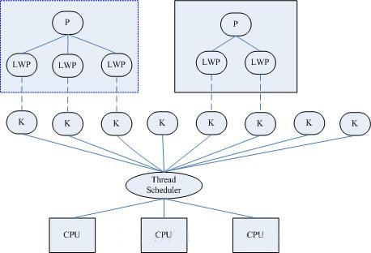

# 04 Threads & Concurrency

## Contents

- Overview

- Multicore Programming

- Multithreading Models

- Thread Libraries

- Implicit Threading

- Threading Issues

- Operating System Examples

### Objectives

- To introduce the notion of a thread—a fundamental unit of CPU utilization that forms the basis of multithreaded computer systems

- To discuss the APIs for the Pthreads, Windows, and Java thread libraries

- To explore several strategies that provide implicit threading

- To examine issues related to multithreaded programming

- To cover operating system support for threads in Windows and Linux

## Overview

- 并发：交替执行（如果是一个核的话）
- 并行：多任务同时执行

### Motivation

Most modern applications are multithreaded. Threads run within application.

Multiple tasks with the application can be implemented by separate threads 应用程序的多个任务可由不同的线程执行. As:

- Update display

- Fetch data

- Spell checking

- Answer a network request.

Process creation is heavy-weight while thread creation is light-weight 进程创建花费的时间是线程创建的 30 倍

Can simplify code, increase efficiency 可以简化代码，提高效率

Kernels are generally multithreaded 内核通常是多线程的

Benefits:

- Responsiveness 可响应性
- Resource Sharing 资源共享
- Economy 经济
- Scalability 可扩展性

## 补充

<https://ng-tech.icu/books/linux-notes/01.%E8%BF%9B%E7%A8%8B%E4%B8%8E%E5%A4%84%E7%90%86%E5%99%A8/%E8%BF%9B%E7%A8%8B%E4%B8%8E%E7%BA%BF%E7%A8%8B/02.%E7%94%A8%E6%88%B7%E7%BA%BF%E7%A8%8B%E4%B8%8E%E5%86%85%E6%A0%B8%E7%BA%BF%E7%A8%8B/>

在 Linux 2.4 版以前，线程的实现和管理方式就是完全按照进程方式实现的；在 Linux 2.6 之前，内核并不支持线程的概念，仅通过轻量级进程（Lightweight Process）模拟线程；轻量级进程是建立在内核之上并由内核支持的用户线程，它是内核线程的高度抽象，每一个轻量级进程都与一个特定的内核线程关联。内核线程只能由内核管理并像普通进程一样被调度。这种模型最大的特点是线程调度由内核完成了，而其他线程操作（同步、取消）等都是核外的线程库（Linux Thread）函数完成的。

为了完全兼容 Posix 标准，Linux 2.6 首先对内核进行了改进，引入了线程组的概念（**仍然用轻量级进程表示线程**），有了这个概念就可以将一组线程组织称为一个进程，不过内核并没有准备特别的调度算法或是定义特别的数据结构来表征线程；相反，线程仅仅被视为一个与其他进程（概念上应该是线程）共享某些资源的进程（概念上应该是线程）。在实现上主要的改变就是在 task_struct 中加入 tgid 字段，这个字段就是用于表示线程组 id 的字段。在用户线程库方面，也使用 NPTL 代替 Linux Thread，不同调度模型上仍然采用 `1 对 1` 模型。

进程的实现是调用 fork 系统调用：`pid_t fork(void);`，线程的实现是调用 clone 系统调用：`int clone(int (*fn)(void *), void *child_stack, int flags, void *arg, ...)`。与标准 `fork()` 相比，线程带来的开销非常小，内核无需单独复制进程的内存空间或文件描写叙述符等等。这就节省了大量的 CPU 时间，使得线程创建比新进程创建快上十到一百倍，能够大量使用线程而无需太过于操心带来的 CPU 或内存不足。无论是 fork、vfork、kthread_create 最后都是要调用 do_fork，而 do_fork 就是根据不同的函数参数，对一个进程所需的资源进行分配。

### 内核线程

内核线程是由内核自己创建的线程，也叫做守护线程（Deamon），在终端上用命令 `ps -Al` 列出的所有进程中，名字以 k 开关以 d 结尾的往往都是内核线程，比如 kthreadd、kswapd 等。与用户线程相比，它们都由 `do_fork()` 创建，每个线程都有独立的 task_struct 和内核栈；也都参与调度，内核线程也有优先级，会被调度器平等地换入换出。二者的不同之处在于，内核线程只工作在内核态中；而用户线程则既可以运行在内核态（执行系统调用时），也可以运行在用户态；内核线程没有用户空间，所以对于一个内核线程来说，它的 0\~3G 的内存空间是空白的，它的 `current->mm` 是空的，与内核使用同一张页表；而用户线程则可以看到完整的 0\~4G 内存空间。

在 Linux 内核启动的最后阶段，系统会创建两个内核线程，一个是 init，一个是 kthreadd。其中 init 线程的作用是运行文件系统上的一系列”init”脚本，并启动 shell 进程，所以 init 线程称得上是系统中所有用户进程的祖先，它的 pid 是 1。kthreadd 线程是内核的守护线程，在内核正常工作时，它永远不退出，是一个死循环，它的 pid 是 2。
