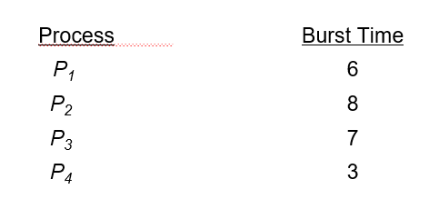

# 05 CPU Scheduling

## Contents

- Basic Concepts

- Scheduling Criteria
- Scheduling Algorithms

- Thread Scheduling

- Multiple-Processor Scheduling

- Real-Time CPU Scheduling

- Operating Systems Examples

- Algorithm Evaluation

### Objectives

- To introduce CPU scheduling, which is the basis for multiprogrammed operating systems

- To describe various CPU-scheduling algorithms

- To discuss evaluation criteria for selecting a CPU-scheduling algorithm for a particular system

- To examine the scheduling algorithms of several operating systems

## Basic Concepts

- Maximum CPU utilization obtained with multiprogramming 多程序运行时 CPU 的最大利用率

- CPU–I/O Burst Cycle – Process execution consists of a cycle of CPU execution and I/O wait 进程执行由 CPU 执行和 I/O 等待周期组成
- CPU burst followed by I/O burst CPU 突发后是 I/O 突发
- CPU burst distribution is of main concern 主要关注 CPU 的突发分布

### CPU Scheduler

Short-term scheduler selects from among the processes in ready queue, and allocates the CPU to one of them. 短期调度程序从就绪队列中选择进程，并将 CPU 分配给其中一个进程。Queue may be ordered in various ways.

CPU scheduling decisions(调度策略) may take place when a process:

1.  Switches from running to waiting state.
2.  Switches from running to ready state.
3.  Switches from waiting to ready.
4.  Terminates.

Scheduling under 1 and 4 is nonpreemptive(不可中断). All other scheduling is preemptive:

- Consider access to shared data 考虑对共享数据的访问
- Consider preemption while in kernel mode 考虑在内核模式的抢占
- Consider interrupts occurring during crucial OS activities 考虑操作系统关键活动期间发生的中断

### Dispatcher

Dispatcher module gives control of the CPU to the process selected by the short-term scheduler; this involves: 调度模块将 CPU 的控制权交给短期调度程序选择的进程；这包括：

- switching context 切换上下文
- switching to user mode 切换到用户模式
- jumping to the proper location in the user program to restart that program 跳转到用户程序中的适当位置以重新启动该程序

## Scheduling Criteria

- CPU utilization – keep the CPU as busy as possible.
- Throughput – # of processes that complete their execution per time unit.
- Turnaround time – amount of time to execute a particular process.
- Waiting time – amount of time a process has been waiting in the ready queue.
- Response time – amount of time it takes from when a request was submitted until the first response is produced, not output (for time-sharing environment).

## Scheduling Algorithms

### First-Come, First-Served (FCFS) Scheduling

Example:

Suppose that the processes arrive in the order: P1, P2, P3

The Gantt Chart for the schedule is 进度表的甘特图为:

非抢占式。

Average waiting time: $(0 + 24 + 27)/3 = 17$

### Shortest-Job-First (SJF) Scheduling

Example:

SJF scheduling chart:

一般是非抢占式。但如果分时间片就可能变成抢占式。

### Round Robin (RR) Scheduling

即为轮转调度。

Example with Time Quantum = 4:

Gantt chart:

## Thread Scheduling

### Multilevel Queue

Ready queue is partitioned into separate queues 就绪队列被分割成不同的队列, e.g.:

- foreground (interactive)

- background (batch)

Process permanently in a given queue 永久处理指定队列

Each queue has its own scheduling algorithm 每个队列都有自己的调度算法:

- foreground – RR

- background – FCFS

Scheduling must be done between the queues:

- Fixed priority scheduling; (i.e., serve all from foreground then from background). Possibility of starvation.

  固定优先级调度（即先从前台再从后台提供服务）。 可能出现饥饿。

- Time slice – each queue gets a certain amount of CPU time which it can schedule amongst its processes;

  时间片-每个队列获得一定量的 CPU 时间，它可以在其进程之间调度

  i.e., 80% to foreground in RR, 20% to background in FCFS

### Multilevel Queue Scheduling

### Multilevel Feedback Queue

过程可以在各个队列之间移动，可以使用老化的方法来实现老化（aging can be implemented this way）。

多级反馈队列调度器定义如下参数：

- 队列的数量

- 每个队列的调度算法

- 确定何时升级进程的方法

- 确定何时降级进程的方法

- 确定当需要服务时，进程将进入哪个队列的方法

用户级线程和内核级线程之间的区别：

- 当支持线程时，调度的是线程，而不是进程
- 多对一和多对多模型，线程库调度用户级线程在 LWP 上运行

  被称为进程保留范围（PCS），因为调度竞争是在进程内部进行的&#x20;

  通常通过程序员设置的优先级来完成

- 调度到可用 CPU 上的内核线程是系统保留范围（SCS） - 系统中所有线程之间的竞争

## Multiple-Processor Scheduling

- CPU 调度在多 CPU 环境下更为复杂
- Homogeneous processors within a multiprocessor
  &#x20;多处理器中的同构处理器
- Asymmetric multiprocessing 非对称多处理器（只有一个处理器访问系统数据结构，缓解了数据共享的需求）
- Symmetric multiprocessing 对称多处理器（SMP）——每个处理器都是自我调度的，共享数据队列或每个处理器都有自己的准备好的进程队列（目前，大多数通用情况都是这个）
- 进程绑定——进程对正在运行的处理器具有绑定
  - 软绑定
  - 硬绑定
  - 包括处理器集合等变体

### Multicore Processors

将多个处理器内核置于同一物理芯片的最新趋势：

- 速度更快，功耗更低
- 每个内核的多个线程数量也在增加（利用内存滞留，在内存检索时在另一个线程上取得进展）

## Real-Time CPU Scheduling

可能会带来明显的挑战：

- 软实时系统 – 无法保证何时安排关键的实时过程
- 硬实时系统 – 任务必须在截止日期前提供服务

两种类型的延迟会影响性能：

- 中断延迟 – 从中断到达到服务中断的例程开始的时间
- 调度延迟 – 计划将当前进程从 CPU 中取出并切换到另一个进程的时间

## Operating Systems Examples

Linux Scheduling:

- Real-time scheduling according to POSIX.1b (Real-time tasks have static priorities 实时任务具有静态优先级)
- Real-time plus normal map into global priority scheme 实时加法线映射到全局优先级计划中
- Nice value of -20 maps to global priority 100（实时进程）
- Nice value of +19 maps to priority 139（一般进程）

## Algorithm Evaluation

How to select CPU-scheduling algorithm for an OS?

- Determine criteria, then evaluate algorithms 确定标准，然后评估算法
- Deterministic modeling 确定性建模
- Type of analytic evaluation 分析评估的类型
- Takes a particular predetermined workload and defines the performance of each algorithm for that workload 采用特定的预定工作负载，并定义该工作

## Extra

### 线程与传统进程的比较

线程具有许多传统进程所拥有的特性，因此有人将它称为轻量级进程，而将传统进程称为重量级进程。线程与传统进程相比则有不少相似之处。

1.  二者都有标识符（ID）、一组寄存器、状态、优先级及所要遵循的调度策略。
2.  进程有一个进程控制块（PCB），线程也有一个线程控制块（TCB）。
3.  进程中的线程共享该进程的资源，子进程也共享父进程的资源，线程和子进程的创建者可以对线程和子进程实施某些控制。如创建者可以撤销、挂起、激活被创建者，以及修改被创建者的优先级，线程和子进程可以改变其属性并创建新的线程和子进程。

传统进程不涉及线程概念，它由进程控制块、程序和数据空间、用户栈和核心栈等组成。在具有多线程结构的进程中，尽管进程仍然具有进程控制块和与本进程关联的程序和数据空间，但每个线程有各自独立的线程控制块、用户栈和核心栈以及线程状态信息。具有多线程结构的进程模型和传统进程的模型如图 2-18 所示。

线程与传统进程主要存在以下 5 个差异。

1.  传统进程除是调度和分派的基本单位外，还是资源分配的基本单位。而在引入线程的操作系统中，线程只是调度和分派的基本单位。
2.  在引入线程的系统中，不仅同一个进程中的多个线程可以并发执行，而且属于不同进程中的多个线程也可以并发执行（也称为进程并发执行），线程并发执行的程度高于传统进程并发执行的程度。
3.  创建和撤销一个线程所花费的时空开销远小于创建和撤销一个传统进程所花费的时空开销。尤其是线程间彼此切换所需的时间远少于传统进程间切换所需要的时间。
4.  传统进程是系统资源分配的基本单位，而线程基本不拥有资源，但可以使用它所隶属进程的资源，如程序段、数据段、打开的文件及 I/O 设备等。不同进程的地址空间是相互独立的，而属于同一个进程的所有线程共享同一个地址空间（该进程的地址空间）。
5.  由于不同进程具有各自独立的数据空间，因此要进行数据传递只能通过通信方式进行，这种方式相对费时而且不方便。但在多线程操作系统中，一个进程的数据空间被该进程的所有线程所共享，一个线程的数据可以直接被属于同一个进程的其他线程所使用，因此数据传递既方便又快捷。

### 线程实现

进程在 CPU 上实现并发，而 CPU 由操作系统管理。因此进程的实现只能由操作系统内核来进行。但线程就不同了，因为线程隶属进程，除操作系统可以管理线程外，当然也可以由进程直接管理线程。因此线程存在着内核态与用户态两种实现方法。

1.  内核态线程实现。
2.  用户态线程实现。
3.  混合式线程实现。
