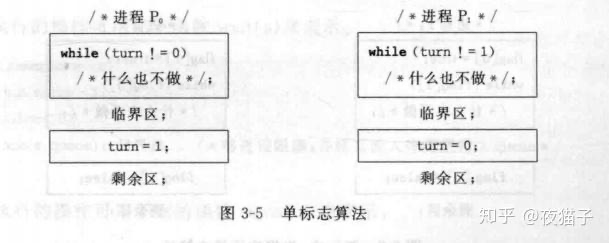
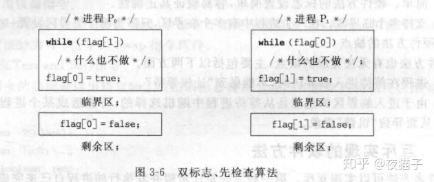
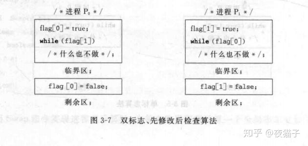
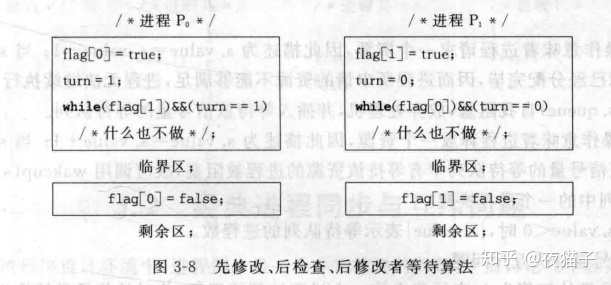
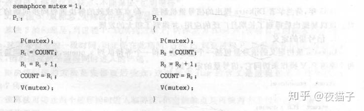
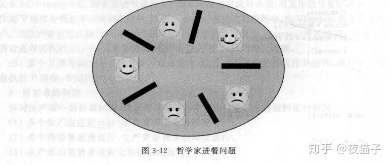

# 06 Synchronization Tools

## Contents

- Background

- The Critical-Section Problem

- Peterson’s Solution

- Synchronization Hardware

- Mutex Locks

- Semaphores

- Classic Problems of Synchronization

- Monitors

- Synchronization Examples&#x20;

- Alternative Approaches

### Objectives

- To present the concept of process synchronization.

- To introduce the critical-section problem, whose solutions can be&#x20;
- used to ensure the consistency of shared data

- To present both software and hardware solutions of the critical-
- section problem

- To examine several classical process-synchronization problems

- To explore several tools that are used to solve process synchronization problems

## Background

- Processes can execute concurrently (May be interrupted at any time, partially completing execution) 进程可以并发执行（可以随时中断，部分完成执行）
- Concurrent access to shared data may result in data inconsistency. 对共享数据的并发访问可能导致数据不一致。
- Maintaining data consistency requires mechanisms to ensure the orderly execution of cooperating processes. 要保持数据的一致性，就必须建立机制，确保合作流程的有序执行。
- Illustration of the problem: Suppose that we wanted to provide a solution to the consumer-producer problem that fills all the buffers. We can do so by having an integer counter that keeps track of the number of full buffers. Initially, counter is set to 0. It is incremented by the producer after it produces a new buffer and is decremented by the consumer after it consumes a buffer. 问题示例：假设我们想为消费者-生产者问题提供一个能填满所有缓冲区的解决方案。我们可以通过一个整数计数器来跟踪已满缓冲区的数量。计数器初始值为 0，生产者产生一个新缓冲区后，计数器会递增，消费者消耗一个缓冲区后，计数器会递减。

### 补充

<https://blog.csdn.net/weixin_42462804/article/details/84091358>

生产者消费者模型：回顾一下 recall，在缓冲区最多只有 BUFFER_SIZE-1 项 ，修改这一算法缺陷

增加一个整数变量 counter，初值为 0，增加一项，counter+1 移走一项递减。
跟踪缓存区的数量（track of the number of full buffer）

存在的问题在于如果并发执行，++，- -会造成错误的结果。

## The Critical-Section Problem

Consider system of $n$ processes $\{p0, p1, … pn-1\}$

Each process has critical section segment of code 每个进程都有关键代码段:

- Process may be changing common variables, updating table, writing file, etc. 过程可能是更改常用变量、更新表格、写入文件等。
- When one process in critical section, no other may be in its critical section. 当一个进程处于临界区段时，其他进程不得处于其临界区段。

Critical section problem is to design protocol to solve this. 临界区问题就是设计协议来解决这个问题。

Each process must ask permission to enter critical section in entry section, may follow critical section with exit section, then remainder section 每个进程必须在入口段请求进入临界段的许可，可以在临界段之后是出口段，然后是剩余段

### Solution to Critical-Section Problem

1.  Mutual Exclusion 互斥 - If process Pi is executing in its critical section, then no other processes can be executing in their critical sections 如果进程 Pi 在其临界区执行，则没有其他进程可以在其临界区执行
2.  Progress 进度 - If no process is executing in its critical section and there exist some processes that wish to enter their critical section, then the selection of the processes that will enter the critical section next cannot be postponed indefinitely 如果没有进程在其临界区段中执行，而存在一些希望进入其临界区段的进程，那么选择下一个进入临界区段的进程的工作就不能无限期推迟。
3.  Bounded Waiting 有限等待 - A bound must exist on the number of times that other processes are allowed to enter their critical sections after a process has made a request to enter its critical section and before that request is granted 在一个进程请求进入其临界区之后，在该请求被批准之前，允许其他进程进入其临界区的次数必须存在一个界限
    - Assume that each process executes at a nonzero speed.&#x20;
    - No assumption concerning relative speed of the n processes.

### 补充

临界区问题：

- 临界区（critical section）：一个进程进入临界区的时候呀，没有其他进程可以进入在临界区执行。
  进程可以改变变量。更新表格，写文件等；
- 进入区（entry section）
- 退出区（exit section）

- 剩余区（remainder section）

临界区问题接待的三项要求：

1.  互斥（mutual exclusion）只能同时执行一个进程

2.  前进（progress）临界区无进程，有进程要进临界区，参与选择进入，有限等待。

3.  有限等待（bounded waiting）进程可以经过有限的等待时间进入临界区。

    两种方法处理临界区问题：

    - 抢占内核(preemptive kernel)允许处于内核模式的进程抢占，Linux，UNIX（Solaris）
    - 非抢占内核（nonpreemptive kernel）Windos XP

### Critical-Section Handling in OS

操作系统中的关键段处理。

两种方法，取决于内核是抢占式还是非抢占式。

- 抢占式--在内核模式下运行时允许进程抢占
- 非抢占式--运行到退出内核模式、阻塞或主动让出（在内核模式下基本上没有竞争条件）

## Peterson’s Solution

- 解决问题的良好算法描述
- 两个进程的解决方案
- 假设`load`和`store`机器语言指令是原子指令，即不能被中断；
- The two processes share two variables:

  - `int turn`
  - `Boolean flag[2]`

- 变量`turn`表示轮到谁进入临界区。
- `flag`数组用于指示进程是否准备进入临界区。`flag[i] = true`意味着进程 Pi 准备就绪！

Algorithm for Process Pi:

```c
do {
  flag[i] = true;
  turn = j;
  while (flag[j] && turn = = j);
    critical section
  flag[i] = false;
    remainder section
 } while (true);

```

- 数据结构：

  两个进程 P0,P1，（Pi,Pj）j=1-i

- 共享数据项：

  Int turn; //那个进程可以进入临界区

  Boolean flag\[2]; //哪个进程想要进入临界区

- 算法说明：

  Turn 的值决定了那个进程可以进入临界区

  只需要证明上面叙述的 3 个临界区的要求即可

## Synchronization Hardware

同步硬件。

- 许多系统为实现关键部分代码提供硬件支持。
- 以下所有解决方案均基于锁定理念（通过锁保护关键区域）
- 单处理器 – 可以禁用中断
  - 当前运行的代码将在不抢占的情况下执行；
  - 在多处理器系统上通常效率太低（使用此操作系统无法广泛扩展）
- 现代机器提供特殊的原子硬件指令（原子 = 不可中断）
  - 测试内存字并设置值
  - 或者交换两个记忆字的内容

Solution to Critical-section Problem Using Locks:

```c
do {
  acquire lock
    critical section
  release lock
    remainder section
} while (TRUE);

```

test_and_set Instruction:

```c
boolean test_and_set (boolean *target)
{
     boolean rv = *target;
     *target = TRUE;
     return rv:
}

```

其中：

- 以原子方式执行
- 返回传递参数的原始值
- 将传递参数的新值设置为“TRUE”。

Bounded-waiting Mutual Exclusion with test_and_set:

```c
do {
   waiting[i] = true;
      key = true;
         while (waiting[i] && key)
      key = test_and_set(&lock);
   waiting[i] = false;
   /* critical section */
   j = (i + 1) % n;
   while ((j != i) && !waiting[j])
      j = (j + 1) % n;
   if (j == i)
      lock = false;
   else
      waiting[j] = false;
   /* remainder section */
} while (true);

```

其中：

- Boolean waiting\[n]; 初始值为 false，true 进入等待队列 &#x20;

- Boolean lock
- 只有`waiting[i]=false`或者`key=false`进入临界区。

推荐阅读：

<https://zhuanlan.zhihu.com/p/164839351>

### 进程的同步与互斥的概念

#### 同步

进程同步是指多个进程中发生的事件存在某种时序关系，必须协同动作共同完成一个任务。简单来讲同步是一种协作关系。

举几个例子： &#x20;

当两个进程运行时，进程 A 需要获取进程 B 此时运行到某一步的运行结果或者信息，才能进行自己的下一步工作，这个时候就得等待进程 B 与自己通信（发送某一个消息或信号），进程 A 再继续执行。这种进程之间相互等待对方发送消息或信号的协作就叫做进程同步。或者工厂的流水线，每道工序都有自己特定的任务，前一道工序没有完成或不合格后一道工序就不能进行。再或者 ABC 三个进程分别负责输入、处理、输出数据，A 必须先执行，B 次之，最后 C。

#### 互斥

多个进程在运行过程中，都需要某一个资源时，它们便产生了竞争关系，它们可能竞争某一块内存空间，也可能竞争某一个 IO 设备。当一方获取资源时，其他进程只能在该进程释放资源之后 才能去访问该资源，这就是进程互斥。简单来说，互斥是一种竞争关系。 &#x20;

举例：假如多个进程同时申请一台打印机，而先申请打印机的一方先使用打印机，当它用完时在给其他进程使用。在一个进程使用打印机期间，其他进程对打印机的使用申请不予满足，这些进程必须等待。

### 进程同步与互斥的软件实现方法

1.  单标志法：两个进程在访问完临界区后会把使用的权限转交给另一个进程，也就是说每个进程进入临界区的权限只能被另一个临界区赋予。

    

    如图，turn 作为标识，turn=0 时，执行 P0，P1 什么也不做。P0 执行完后 turn=1，则执行 P1，P0 不执行。 &#x20;
    缺点：不能保证空闲让进。拿澡堂洗澡举例，P0 进入卫生间洗澡当洗完时，P1 并不知道 P0 洗完了，这就造成资源极大浪费。

2.  双标志先检查法：设置一个布尔型数组`flag[]`，数组中各个元素用来标记各进程想进入临界区的意愿，比如 `flag[0] = true` 意味着 0 号进程 P0 现在想要进入临界区。

    如图：

    

    假设初始时，flag【0】为 true，则说明 P0 进入临界区，此时 P1 接受到消息 P0 进入临界区了就什么也不做。P0 执行完后，进程 p1 访问，进入临界区前也传达信息 p1 进入临界区。

    洗澡的例子：若 P0 洗澡，则对外开一个指示灯，表示此卫生间有人，则需等待指示灯灭时方可进入。解决了空闲让进的问题，避免资源浪费。

    缺点：假设初始 flag 都为 false，则两个进程同时进入临界区，不符合忙则等待条件。

3.  双标志先修改后检查法：双标志先检查法得改版，前一个算法的问题是先检查后上锁，但是这两个操作又无法一气呵成，因此导致了两个进程同时进入临界区的问题。因此，人们又想到了先“上锁”，后检查的方法，来避免上述问题。但有可能导致两个进程都无法进入临界区的问题。

    如图：

    

    例子：这就相当于提前声明。p0 说我先洗，p1 让给 p0，等 p0 执行完后在执行 p1.但若是两个都过分谦让，哈哈，两个人就都没有进，资源就会被浪费。

4.  Peterson 算法（先修改，后检查，后修改者等待算法）：双标志后检查法中，两个进程都争着想进入临界区，但是谁也不让谁，最后谁都无法进入临界区。Peterson 想到了一种方法，如果双方都争着想进入临界区，那可以让进程尝试“孔融让梨”，主动让对方先使用临界区。

    结合算法（1）和算法（3）的概念， 标志`flag[0]` 为 true 表示进程 P。想进入临界区， 标志 turn 表示要在进人区等待进程标识。在进入区先修改后检查， 通过修改同一标志 turn 来描述标志修改的先后； 检查对方标志 flag， 如果对方不想进人， 自己再进人。如果对方想进人， 则检查标志 turn， 由于 turn 中保存的是较晚的一次赋值， 因此较晚修改标志的进程等待， 较早修改标志的进程进入临界区，如图 3-8 所示。

    

信号量和 PV 操作

#### 定义和执行过程&#xA;

荷兰计算机科学家 Dijkstra 于 1965 年提出了解决进程同步与互斥问题的信号量机制，收到了很好的效果，被一直沿用至今，广泛应用与单处理机和多处理机系统以及计算机网络中。信号量机制就是说两个或者多个进程通过他们都可以利用的一个或多个信号来实现准确无误不冲突的并发执行。如果临界资源不够，就会有一个信号表示出来，如果进程此时想访问，那么就会阻塞到一个队列中，等待调度。当临界资源使用完毕，一个进程改变信号，并及时唤醒阻塞的进程，这就实现了进程间的同步和互斥问题。&#x20;

信号量分为整型信号量，记录型信号量，AND 信号量以及信号量集。最初的信号量就是整型信号量，定义信号量为一个整型变量，仅能通过两个原子操作 P,V 来访问，所谓原子操作就是指一组相联的操作要么不间断地执行，要么不执行。这两个操作又称为 wait 和 signal 操作或者 down 和 up 操作。之所以叫 P,V 操作是因为 Dijkstra 是荷兰人，P 指的是荷兰语中的“proberen”，意为“测试”，而 V 指的是荷兰语中的“verhogen”，意为“增加”。

Dijkstra 最初定义的信号量包括一个整型值 S 和一个等待队列 S.queue,信号量只能通过两个原语 P、V 操作来访问它，信号量的定义如下：

```c
srtuct semaphore{
  int value;
  struct PCB *queue;
}

```

P 原语执行的操作：

```c
void wait(semaphore s)
{
  s.value=s.value-1;
  if(s.value<0)
    block(s.queue);
}

```

首先将 S.value 减 1，表示该进程需要一个临界资源，如果`S.value<0`，那么说明原来的`S.value <= 0`，即已经没有资源可用了，于是将进程阻塞到与信号量 S 相关的阻塞队列中去，如果`S.value<0`,那么|S.value|其实就表示阻塞队列的长度，即等待使用资源的进程数量。

V 原语执行的操作：

```c
void signal(semaphore s)
{
  s.value=s.value+1;
  if(s.value<=0)
    wakeup(s.queue);
}
```

V 操作：首先 S.value 加 1，表示释放一个资源，如果`S.value <= 0`，那么说明原来的`S.value < 0`，阻塞队列中是由进程的，于是唤醒该队列中的一个进程。那么，为什么`S.value > 0`时不唤醒进程呢，很简单，因为阻塞队列中没有进程了。

P 操作相当于“等待一个信号”，而 V 操作相当于“发送一个信号”，在实现同步过程中，V 操作相当于发送一个信号说合作者已经完成了某项任务，在实现互斥过程中，V 操作相当于发送一个信号说临界资源可用了。实际上，在实现互斥时，P,V 操作相当于申请资源和释放资源。 &#x20;

#### 用信号量解决同步与互斥

如果信号量的初值为 1，定义 mutex 为互斥信号量，P1P2 两进程共享变量 count。那么互斥实现过程如下图。



如此，P1 在执行的过程中，P2 不能执行，p1p2 无论按照怎样的次序进行。count 值都为 7.

## Mutex Locks

互斥锁。

- 以前的解决方案很复杂，应用程序员通常无法访问
- 操作系统设计人员构建软件工具来解决关键部分问题
- 最简单的是互斥锁
- 通过首先`acquire()` 锁然后`release()` 锁来保护关键部分 指示锁定是否可用的布尔变量
- 对`acquire()` 和`release()` 的调用必须是原子（通常通过硬件原子指令实现）
- 但是这个解决方案需要 busy waiting（因此，此锁称为 spinlock）

`acquire()` and `release()`:

```c
acquire() {
      while (!available)
      ; /* busy wait */
   available = false;
}

release() {
   available = true;
}

do {
acquire lock
   critical section
release lock
  remainder section
} while (true);

```

注意：`while (!available)` 如果 available 为 false 的话会发生空转

## Semaphores

信号量。

同步工具，为进程同步其活动提供更复杂的方法（比互斥锁更复杂）。

数据结构： &#x20;

- 信号量 S 是个整数变量，初始化（只能通过两个不可分割（原子）操作访问）

  `wait()` 减少信号量计数

  ```c
  wait(S) {
      while (S <= 0)
         ; // busy wait
      S--;
  }

  ```

  `signal()` 增加信号量计数

  ```c
  signal(S) {
      S++;
  }

  ```

- 两个函数中的对整型的修改不可分的进行

克服忙等待：

- 当进程调用 wait 发现信号量为负时，阻塞自己，将该进程放到与信号量相关的等待队列中
- signal 从等待进程的链表上取一个进程并唤醒

```c
typedef struct {
  int value;
  struct process *list;
}

wait(semaphore *S) {
   S->value--;
   if (S->value < 0) {
      add this process to S->list;
      block();
   }
}

signal(semaphore *S) {
   S->value++;
   if (S->value <= 0) {
      remove a process P from S->list;
      wakeup(P);
   }
}

```

### Deadlock and Starvation

死锁和饥饿：两个或多个进程无限的等待一个事件，该事件只能由这些等待进程之一来实现

- 死锁：多个进程无限等待一个事件，该事件只能由这些等待进程之一来产生
- 饥饿：进程无限等待信号量

解决方案：优先级继承，即持锁进程的优先级被临时设置为锁等待队列中优先级最高的那个进程的优先级。

## Classic Problems of Synchronization

经典同步问题。

### 生产者-消费者问题（共享有限缓冲区）

Bounded-Buffer Problem

> 同样参考自：
>
> <https://zhuanlan.zhihu.com/p/164839351>
>
> 生产者消费者问题是指有两组进程共享一个环形的缓冲池。一组进程为生产者，一组进程为消费者。缓冲池由若干个大小相等的缓冲区组成。 生产者将产品放入缓冲池，消费者从缓冲池取出产品。
>
> 同步过程：当缓冲池满时，生产者进程必须停止生产唤醒消费者进程，同样，缓冲池空闲时，消费者必须唤醒生产者。
>
> 互斥过程：显然缓冲池是一个临界资源，生产者或消费者只能单独使用它。

两个进程共享一个公共的固定大小的缓冲区。其中的一个，生产者，将信息放入缓冲区；另一个，消费者，从缓冲区中取出信息（该问题也可被推广到 m 个生产者，n 个消费者的情况）

同步分析基本方法：

1.  找出需要同步的代码片段（关键代码）
2.  分析这些代码片段的执行次序，谁先谁后，有没有一定的次序
3.  根据次序分析，增加同步信号量并赋初值

4.  在关键代码前后分别加 wait 和 signal 操作

解决：基于信号量

```c
int n;
semephore mutex 1;
semaphore empty n;
semaphore full 0;

// producer
do {
  /* 生产一个产品 */
  wait(empty);
  wait(mutex); // mutex：互斥
  /* 修改buffer */
  signal(mutex);
  signal(full);
} while (true);

// consumer
do {
  wait(full);
  wait(mutex);
  /* 修改buffer */
  signal(mutex);
  signal(empty);
  /* 取出一个产品 */·
} while (true);
```

- 信号量 Empty（空缓冲项）初始化为 n
- full(满缓冲项)个数初始化为 0
- Semaphore mutex initialized to the value 1

### 读者-写者问题（数据读写操作）

Readers and Writers Problem

> 一个数据库可以为多个并发进程所共享。其中，有的进程可能只需要读数据库，而其他进程可能要更新(即读和写)数据库。为了区分这两种类型的进程，将前者称为读者，而将后者称为写者。显然，如果两个读者同时访问共享数据，那么不会产生什么不利的结果。然而，如果一个写者和其他线程(既不是读者也不是写者)同时访问共享对象，很可能混乱。为了确保不会产生这样的困难，要求写者对共享数据库有排他的访问。这一同步问题称为读者-写者问题。
>
> 在读者一写者问题中，任何时刻要求“写者”最多只允许有一个，而“读者”则允许有多个。因为多个“读者”的行为互不干扰，它们只是读数据，而不会改变数据对象的内容。而“写者”则不同，它们要改变数据对象的内容，如果它们同时操作，则数据对象的内容将会变得不可知。所以，对共享资源的读写操作的限制条件如下所述。
>
> 1.  允许任意多读进程同时读。
> 2.  一次只允许一个写进程进行写操作。
> 3.  如果有一个写进程正在进行写操作，禁止任何读进程进行读操作。
>
> 信号量解决读写者问题：
>
> 为了解决该问题，只需解决“写者与写者”和“写者与第一个读者”的互斥问题即可，为此引入一个互斥信号量 W mutex。为了记录谁是第一个读者， 可以用一个全局整型变量 Rcount 做一个计数器。而在解决问题的过程中， 由于使用了全局变量 Rcount， 该变量又是一个临界资源， 对于它的访问仍需要互斥进行， 所以需要一个互斥信号量 R mutex。

矛盾问题描述：读者可以同时访问数据，写者不可以访问数据，写者在写的时候读者不可访问数据

- 第一读者-作者问题：读者和作者等待，优先读者
- 第二读者-作者问题：读者和作者等待，优先作者

数据结构：

- Semaphore mutex,wrt; 初始化均为 1
- Int readcount; 初始化为 0

读者进程：

```c
do {
  wait(mutex);
  read_count++;
  if (read_count == 1)
        wait(rw_mutex);
     signal(mutex);
       ...
  /* reading is performed */
       ...
     wait(mutex);
  read_count--;
  if (read_count == 0)
        signal(rw_mutex);
     signal(mutex);
} while (true);

```

写者进程：

```c
do {
   wait(rw_mutex);
       ...
    /* writing is performed */
       ...
      signal(rw_mutex);
} while (true);
```

> 对于读者一写者问题，有以下 3 种优先策略。 &#x20;
>
> 1.  读者优先。即当读者进行读时，后续的写者必须等待，直到所有读者均离开后，写者才可以进入。前面的程序隐含使用了该策略。
> 2.  写者优先。即当一个写者到来时，只有那些已经获得授权允许读的进程才被允许完成它们的操作，写者之后到来的新读者将被推迟，直到写者完成。在该策略中，如果有一个不可中断的连续的写者，读者进程会被无限期地推迟。
> 3.  公平策略。以上两种策略， 读者或写者进程中一个对另一个有绝对的优先权， Hoare 提出了一种更公平的策略，由如下规定定义。 &#x20;
>
>     规则 1：在一个读序列中，如果有写者在等待，那么就不允许新来的读者开始执行。
>
>     规则 2：在一个写操作结束时，所有等待的读者应该比下一个写者有更高的优先权。

### 哲学家用餐问题（资源竞争）

Dining-Philosophers Problem

哲学家消耗生命吃饭和思考

不能和邻居交流，有时拿起两个筷子（一次）开始吃饭
需要一双筷子吃饭，吃完之后放下一双筷子

哲学家问题的解决方法：

- 最多只有 4 个哲学家可以坐在座子上
- 两个筷子都可使用的时候才允许一个哲学家拿起来
- 非对称解决方法，拿起筷子的顺序不一样

> 哲学家进餐问题是一个典型的同步问题， 它由 Dijkstra 提出并解决。有 5 个哲学家， 他们的生活方式是交替思考和进餐。哲学家们共用一张圆桌，围绕圆桌而坐，在圆桌上有 5 个碗和 5 支筷子，平时哲学家进行思考，饥饿时拿起其左、右两支筷子，试图进餐，进餐完毕又进行思考。这里的问题是哲学家只有拿到靠近他的两支筷子才能进餐，而拿到两支筷子的条件是他的左、右邻居此时都没有进餐。
>
> 

用信号量解决哲学家进餐问题：

```c
do {
  wait(chopstick[i]);
  wait(chopstick[(i+1)%5]);
  /* eat */
  signal(chopstick[i]);
  signal(chopstick[(i+1)%5]);
} while (true);
```

在以上描述中，虽然解决了两个相邻的哲学家不会同时进餐的问题，但是有一个严重的问题，如果所有哲学家总是先拿左边的筷子，再拿右边的筷子，那么就有可能出现这样的情况，就是 5 个哲学家都拿起了左边的筷子，当他们想拿右边的筷子时，却因为筷子已被别的哲学家拿去，而无法拿到。此时所有哲学家都不能进餐，这就出现了死锁现象。

AND 信号量解决哲学家进餐问题：

```c
semaphore chopstick[5]= (1,1,1,1,1)；

void philosopher() /*街学家进程*/
{
  while (true)
  Swait(chopstick[i],chopstick[(i+1)%5]);
  ...;
  eat; /*进餐*/
  ...;
  Ssignal(chopstick[i],chopstick[(i+1) % 5]);
  ...;
  think; /*思考*/
  ...;
}
```

## Monitors

- A high-level abstraction that provides a convenient and effective mechanism for process synchronization

- Abstract data type, internal variables only accessible by code within the procedure

- Only one process may be active within the monitor at a time

- But not powerful enough to model some synchronization schemes

## Synchronization Examples

Linux:

- Prior to kernel Version 2.6, disables interrupts to implement short critical sections

- Version 2.6 and later, fully preemptive

Linux provides:

- Semaphores

- atomic integers

- spinlocks

- reader-writer versions of both

On single-cpu system, spinlocks replaced by enabling and disabling kernel preemption

Alternative Approaches

- Transactional Memory

- OpenMP

- Functional Programming Languages
