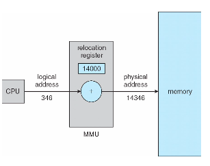

# 09 Memory Management

## Summary

- Background
- Swapping
- Contiguous Memory Allocation
- Segmentation
- Paging
- Structure of the Page T able
- Example: The Intel 32 and 64-bit Architectures
- Example: ARM Architecture

### Objectives

- To provide a detailed description of various ways of organizing memory hardware
- To discuss various memory-management techniques, including paging and segmentation
- To provide a detailed description of the Intel Pentium, which supports both pure segmentation and segmentation with paging

## Background

- Program must be brought (from disk) into memory and placed within a process for it to be run
- Main memory and registers are only storage CPU can access directly
  主存储器和寄存器只有存储 CPU 可以直接访问
- Memory unit only sees a stream of addresses + read requests, or address + data and write requests
  内存单元只能看到地址读取请求或地址数据和写入请求的流
- Register access in one CPU clock (or less)
  在一个 CPU 时钟 (或更少) 的寄存器访问
- Main memory can take many cycles, causing a stall
- Cache sits between main memory and CPU registers
  高速缓存位于主内存和 CPU 寄存器之间
- Protection of memory required to ensure correct operation

### Base and Limit Registers

- A pair of base and limit registers(寄存器的基础位置和高位) define the logical address space
- CPU must check every memory access generated in user mode to be sure it is between base and limit for that user

### Address Binding

- Programs on disk, ready to be brought into memory to execute form an input queue
- Inconvenient to have first user process physical address always at 0000
  使第一个用户进程物理地址始终处于 0000 时不方便
- Further, addresses represented in different ways at different stages of a program’s life
  此外，在程序生命的不同阶段以不同方式表示的地址

### Binding of Instructions and Data to Memory

Address binding of instructions and data to memory addresses can happen at three different stages
指令和数据到内存地址的地址绑定可以在三个不同的阶段发生

- Compile time: If memory location known a priori, absolute code can be generated; must recompile code if starting location changes
  编译时间: 如果内存位置已知先验，则可以生成绝对代码; 如果起始位置更改，则必须重新编译代码
- Load time: Must generate relocatable code if memory location is not known at compile time
  加载时间: 如果在编译时不知道内存位置，则必须生成可重定位代码
- Execution time: Binding delayed until run time if the process can be moved during its execution from one memory segment to another
  执行时间: 如果进程在执行期间可以从一个内存段移动到另一个内存段，则绑定会延迟到运行时

### Logical vs. Physical Address Space

- The concept of a logical address space that is bound to a separate physical address space is central to proper memory management
  绑定到单独的物理地址空间的逻辑地址空间的概念对于正确的内存管理至关重要
  - Logical address – generated by the CPU; also referred to as virtual address
  - Physical address – address seen by the memory unit
- Logical and physical addresses are the same in compile-time and load-time address-binding schemes; logical (virtual) and physical addresses differ in execution-time address-binding scheme
  逻辑和物理地址在编译时和加载时地址绑定方案中是相同的; 逻辑 (虚拟) 和物理地址在实际执行时地址绑定方案中是不同的
- Logical address space is the set of all logical addresses generated by a program
- Physical address space is the set of all physical addresses generated by a program

### Memory-Management Unit (MMU)

- Hardware device that at run time maps virtual to physical address
  在运行时将虚拟地址映射到物理地址的硬件设备
- Many methods possible, covered in the rest of this chapter
- To start, consider simple scheme where the value in the relocation register is added to every address generated by a user process at the time it is sent to memory
  首先，考虑简单的方案，其中重定位寄存器中的值被添加到用户进程在发送到内存时生成的每个地址
  - Base register now called relocation register
    基址寄存器现在称为重定位寄存器
  - MS-DOS on Intel 80x86 used 4 relocation registers
- The user program deals with logical addresses; it never sees the real physical addresses
  - Execution-time binding occurs when reference is made to location in memory
    执行时绑定发生在引用内存中的位置时
  - Logical address bound to physical addresses

### Dynamic relocation using a relocation register

- Routine is not loaded until it is called
  直到调用例程时才加载例程
- Better memory-space utilization; unused routine is never loaded
  更好的内存空间利用率; 未使用的例程永远不会加载
- All routines kept on disk in relocatable load format
- Useful when large amounts of code are needed to handle infrequently occurring cases
  当需要大量代码来处理不经常发生的情况时很有用
- No special support from the operating system is required

### Dynamic Linking

- Static linking – system libraries and program code combined by the loader into the binary program image
  静态链接-系统库和程序代码由加载器组合成二进制程序映像
- Dynamic linking –linking postponed until execution time
  动态链接-链接推迟到执行时间
- Small piece of code, stub, used to locate the appropriate memory-resident library routine
  一小段代码，存根，用于定位适当的内存驻留库例程
- Stub replaces itself with the address of the routine, and executes the routine
- Operating system checks if routine is in processes’ memory address
- Dynamic linking is particularly useful for libraries
  动态链接对库特别有用
- System also known as shared libraries
  系统也称为共享库
- Consider applicability to patching system libraries
  考虑修补系统库的适用性

## Swapping

- A process can be swapped temporarily out of memory to a backing store, and then brought back into memory for continued execution
  进程可以暂时从内存交换到后备存储，然后恢复到内存中继续执行
- Backing store – fast disk large enough to accommodate copies of all memory images for all users; must provide direct access to these memory images
  后备存储-足够大的磁盘以容纳所有用户的所有内存映像的副本; 必须提供对这些内存映像的直接访问
- Roll out, roll in – swapping variant used for priority-based scheduling algorithms; lower-priority process is swapped out so higher-priority process can be loaded and executed
  Roll out，roll in-用于基于优先级的调度算法的交换变体; 较低优先级的进程被交换出去，因此可以加载和执行较高优先级的进程
- Major part of swap time is transfer time; total transfer time is directly proportional to the amount of memory swapped
  交换时间的主要部分是传输时间; 总传输时间与交换的内存量成正比
- System maintains a ready queue of ready-to-run processes which have memory images on disk
  系统维护一个准备运行的进程的就绪队列，这些进程在磁盘上具有内存映像

### Context Switch Time including Swapping

- If next processes to be put on CPU is not in memory, need to swap out a process and swap in target process
  如果要放在 CPU 上的下一个进程不在内存中，则需要换出一个进程并换入目标进程
- Context switch time can then be very high
  上下文切换时间可能会非常长
- Can reduce if reduce size of memory swapped – by knowing how much memory really being used

## Contiguous Memory Allocation

> 连续内存分配

- Main memory must support both OS and user processes
  主内存必须同时支持操作系统和用户进程
- Limited resource, must allocate efficiently(高效分配)
- Contiguous allocation is one early method
- Main memory usually into two partitions:
  - Resident operating system, usually held in low memory with interrupt vector
    常驻操作系统，通常以中断向量保存在低内存中
  - User processes then held in high memory
  - Each process contained in single contiguous section of memory
    包含在内存的单个连续部分中的每个进程
- Relocation registers used to protect user processes from each other, and from changing operating-system code and data
  重定位寄存器用于保护用户进程彼此之间以及操作系统代码和数据的更改
  - Base register contains value of smallest physical address
    基址寄存器包含最小物理地址的值
  - Limit register contains range of logical addresses – each logical address must be less than the limit register
    限制寄存器包含逻辑地址范围-每个逻辑地址必须小于限制寄存器
  - MMU maps logical address dynamically
  - Can then allow actions such as kernel code being transient and kernel changing size
    然后可以允许诸如内核代码为瞬态和内核更改大小之类的操作

### Multiple-partition allocation

> 多分区分配

- Degree of multiprogramming limited by number of partitions
  受分区数限制的多程序设计程度
- Variable-partition sizes for efficiency (sized to a given process’ needs)
  可变分区大小以提高效率 (根据给定进程的需要进行调整)
- Hole – block of available memory; holes of various size are scattered throughout memory
  可用内存的空穴块; 各种大小的孔分散在整个内存中
- When a process arrives, it is allocated memory from a hole large enough to accommodate it
  当一个进程到达时，它从一个足够大的孔分配内存来容纳它
- Process exiting frees its partition, adjacent free partitions combined
  进程退出释放其分区，相邻的自由分区合并
- Operating system maintains information about:
  操作系统维护有关以下内容的信息:

  a) allocated partitions b) free partitions (hole)

### Dynamic Storage-Allocation Problem

How to satisfy a request of size n from a list of free holes?

- First-fit: Allocate the first hole that is big enough
- Best-fit: Allocate the smallest hole that is big enough; must search entire list, unless ordered by size

" Produces the smallest leftover hole &#x20;
! Worst-fit: Allocate the largest hole; must also search entire list

" Produces the largest leftover hole &#x20;
First-fit and best-fit better than worst-fit in terms of speed and storage

utilization

## Segmentation

## Paging

页表寄存器

断表寄存器

逻辑页号

内存页框

## Structure of the Page T able

## Example: The Intel 32 and 64-bit Architectures

## Example: ARM Architecture
