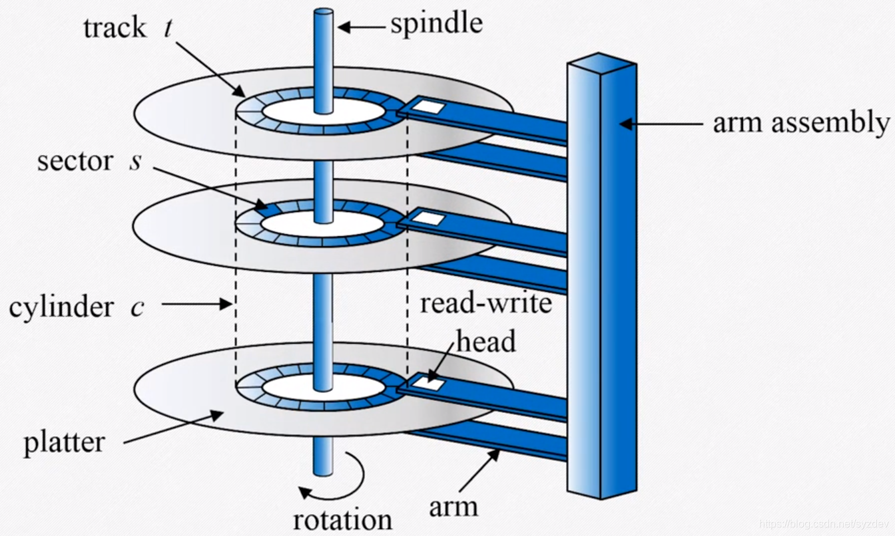

# 11 Mass-Storage Systems

## Contents

- Overview of Mass Storage Structure

- Disk Structure

- Disk Attachment

- Disk Scheduling

- Disk Management

- Swap-Space Management

- RAID Structure

- Stable-Storage Implementation

### Objectives

- To describe the physical structure of secondary storage devices and its effects on the uses of the devices
- To explain the performance characteristics of mass-storage devices
- To evaluate disk scheduling algorithms
- To discuss operating-system services provided for mass storage,

  including RAID

## Overview of Mass Storage Structure

- Magnetic disks provide bulk of secondary storage of modern computers
  磁盘提供现代计算机的大量辅助存储
  - Drives rotate at 60 to 250 times per second
  - Transfer rate is rate at which data flow between drive and computer
    传输速率是驱动器和计算机之间数据流的速率
  - Positioning time (random-access time) is time to move disk arm to desired cylinder (seek time) and time for desired sector to rotate under the disk head (rotational latency)
    定位时间 (随机存取时间) 是将磁盘臂移动到所需柱面的时间 (寻道时间) 和所需扇区在磁盘磁头下旋转的时间 (旋转等待时间)
  - Head crash results from disk head making contact with the disk surface -- That’s bad
    磁盘磁头与磁盘表面接触会导致磁头崩溃-这很糟糕
- Disks can be removable
- Drive attached to computer via I/O bus 输入/输出总线
  - Busses vary, including EIDE, ATA, SATA, USB, Fibre Channel, SCSI, SAS, Firewire
    总线各不相同，包括 EIDE、ATA、SATA、USB、光纤通道、SCSI、SAS、Firewire
  - Host controller in computer uses bus to talk to disk controller built into drive or storage array
    计算机中的主机控制器使用总线与内置在驱动器或存储阵列中的磁盘控制器进行通信

## Disk Structure

文件是放在磁盘上的，因此磁盘的性能是对操作文件有很大的影响。下图是一个磁盘的结构示意图，很多个磁盘 platter 围绕着一个轴 spindle 旋转，磁盘旁边有磁柱 arm assembly，磁柱上有磁臂 arm，磁臂的末端有磁头 read-write head，每个磁头就可以访问盘面上的相关信息：

对磁盘划分时，我们把磁盘划分为很多个同心的圆环叫做磁道`track`，每个磁道上又划分了很多等大小的块叫扇区`sector`，在各个同心圆环上同一个磁道上的磁盘叫做柱面`cylinder`。

> 磁盘储存数据的原理和盒式磁带类似，只不过盒式磁带上存储是模拟格式的音乐，而硬盘上存储的是数字格式的数据。写入时，磁头线圈上加电，在周围产生磁场，磁化其下的磁性材料；电流的方向不同，所以磁场的方向也不同，可以表示 0 和 1 的区别。读取时，磁头线圈切割磁场线产生感应电流，磁性材料的磁场方向不同，所以产生的感应电流方向也不同。

磁盘由若干磁盘组成，绕枢轴高速旋转，目前主流磁盘转速 7200 转/分；我们在定位磁盘上的某个记录时，往往需要如下三个参数：

- 柱面号：各盘面所有的读写头同时移动，并定位在同样的垂直位置的磁道上，这些磁道形成了一个柱面。由外向内是：0，1，2，……，L；

- 磁头号：磁盘的全部有效盘面从上到下依次编号：0，1，2，……，H。磁头号与盘面号是相对应的；

- 扇区号：将各盘面分割成若干大小相等的扇区，编号：0，1，2，3，……，n。

磁盘设备是以一种逻辑块的一维大数组的形式编址的，这里的逻辑块是传输的最小单位。逻辑块的一维数组映射到磁盘上一些相连的扇区。0 扇区是最外边柱面的第一个磁道的第一个扇区。数据首先都映射到一个磁道，其余的数据映射到同一柱面的其他磁道，然后按照从外向里的顺序映射到其余的柱面。

磁盘 I/O 速度的高低，将直接影响文件系统的性能。提高磁盘 I/O 速度的主要途径有：

- 选择性能好的磁盘；

- 设置磁盘高速缓冲区；

- 采用好的磁盘调度算法。

前两种方法都是在硬件上下功夫，最后一种方法是可以由操作系统来控制的，因此我们主要讨论磁盘调度算法。

好的磁盘调度算法可以缩短磁盘的访问时间，磁盘的访问时间分为如下三种：

- 寻道时间 Ts：把磁头从当前位置移动到指定磁道上所经历的时间，它与磁盘转速、移动的磁道数有关；

- 旋转延迟时间 Tr：指定扇区移动到磁头下面所经历的时间；

- 传输时间 Tt：指把数据从磁盘读出，或向磁盘写入数据所经历的时间。

Disk Attachment

Disk Scheduling

Disk Management

Swap-Space Management

RAID Structure

Stable-Storage Implementation
