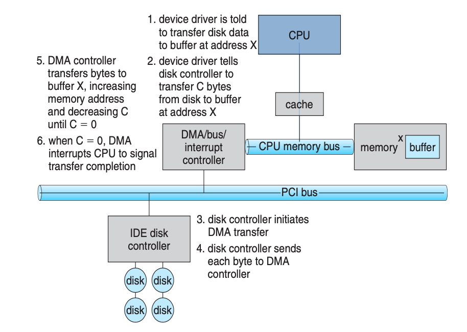

# 12 I/O System

## Contents

- Overview
- I/O Hardware
- Application I/O Interface
- Kernel I/O Subsystem
- Transforming I/O Requests to Hardware Operations
- STREAMS
- Performance

### Objectives

- Explore the structure of an operating system’s I/O subsystem &#x20;
- Discuss the principles of I/O hardware and its complexity &#x20;
- Provide details of the performance aspects of I/O hardware and software

## Overview

对与计算机相连设备的控制是操作系统设计者的主要任务之一。因为 I/O 设备在其功能与速度方面存在很大的差异，所以需要采用多种方法来控制设备。这些方法形成了 I/O 子系统的核心，该子系统使内核其他部分不必涉及复杂的 I/O 设备管理。

I/O 设备技术呈现两个相矛盾的趋势：

- 一方面，可以看到硬件与软件接口日益增长的标准化。这一趋势有助于将设备集成到现有计算机和操作系统。

- 另一方面，也可以看到 I/O 设备日益增长的多样性。有的新设备与以前的设备区别很大，以至于很难集成到计算机和操作系统中，这种困难需要运用软件技术和硬件技术一起来解决。

一般的解决方法：

- I/O 设备的基本要素如端口、总线和设备控制器适用于许多不同的 I/O 设备。为了封装不同设备的细节和特点，操作系统内核设计成使用设备驱动程序模块的结构。设备驱动程序为 I/O 子系统提供了统一设备访问接口，就像系统调用为应用程序和操作系统之间提供了统一的标准接口一样。

## I/O Hardware

总线： 是一组线和一组严格定义的可以描述在线上传输信息的协议。

控制器： 是用于操作端口、总线或设备的一组电子器件。

处理器如何向控制器发送命令和数据以完成 I/O 传输？

- 控制器可以有一个或多个用于数据和控制信号寄存器。处理器通过读写这些寄存器的位模式来与控制器通信。这种通信的一种方法是通过使用特殊 I/O 指令来向指定的 I/O 端口地址传输一个字节或字。

- 设备控制器也可支持内存映射 I/O。这时，设备控制寄存器被映射到处理器的地址空间。处理器执行 I/O 请求是通过标准数据传输指令来完成对设备控制器的读写。

I/O 端口通常有四种寄存器：

- 状态寄存器： 包含一些主机可以读取的位(bit)。这些位指示各种状态，例如，当前任务是否完成，数据输入寄存器是否有数据可以读取，是否出现设备故障等。

- 控制寄存器： 可以被主机用来向设备发送命令或改变设备状态。

- 数据输入寄存器： 被主机读出以获取数据。

- 数据输出寄存器： 被主机写入以发送数据。

> 下面都是讲主机如何与 I/O 进行交互的协议或硬件支持

### 轮询

控制器有 1bit 来显示其状态，主机的命令寄存器有 1bit 就绪位来显示其状态。控制器工作忙时就置忙位，而可以接收下一命令时就清忙位。主机通过命令寄存器中命令就绪位来表示其意愿。当主机有命令需要控制器执行时，就置命令就绪位。

具体握手协议如下：

1.  主机不断地读取忙位，直到该位被清除。

2.  主机设置命令寄存器中的写位并向数据输出寄存器中写入一个字节。

3.  主机设置命令就绪位。

4.  当控制器注意到命令就绪位以被设置，则设置忙位。

5.  控制器读取命令寄存器，并看到写命令。它从数据输出寄存器中读取一个字节，并向设备执行 I/O 操作。

6.  在步骤 1 中，主机处于忙等待或轮询。

### 中断

中断在第一章提到过。

### 直接内存访问(DMA)

DMA 需要硬件支持，称为直接内存访问(direct-memory access)控制器。

DMA 具体传输步骤 Six Step Process to Perform DMA Transfer：

## Application I/O Interface

### 块与字符设备

块设备：

- 命令包括 read, write, seek。

- 访问方式包括生 I/O,直接 I/O 和内存映射。

字符设备：

- 命令包括 get，put。
- 可以构造库以提供具有缓冲和编辑功能的按行访问。

### 网络设备

比如 Socket 接口。

### 时钟与定时器

- 可以获取当前时间，逝去的时间。
- 可以设置定时器，在 T 是触发操作 X。
- 测量逝去时间和触发操作的硬件称为可编程间隔定时器，它可被设置为等待一定时间，然后触发中断。

### 阻塞与非阻塞 I/O

阻塞 IO: 指的是需要内核 IO 操作彻底完成后，才返回到用户空间执行用户的操作。阻塞指的是用户空间程序的执行状态。传统的 IO 模型都是同步阻塞 IO。在 Java 中，默认创建的 socket 都是阻塞的。

非阻塞 IO：指的是用户空间的程序不需要等待内核 IO 操作彻底完成，可以立即返回用户空间执行用户操作，即处于非阻塞的状态，与此同时内核会立即返回给用户一个状态值。

简单来说：阻塞是指用户空间（调用线程）一直在等待，而不能干别的事情；非阻塞是指用户空间（调用线程）拿到内核返回的状态值就返回自己的空间，IO 操作可以干就干，不可以干就去干别的事情。

## Kernel I/O Subsystem

### I/O 调度

调度一组 I/O 就是确定一个合适的顺序来执行这些请求。应用程勋发布的系统调用顺序不一定总是最佳选择，调度能改善系统整体性能，如磁盘调度，重新安排服务顺序增加性能就是 I/O 调度的核心。

操作系统开发人员通过为每个设备维护一个请求队列来实现调度。

### 缓冲

缓冲区是用来保存两个设备之间或在设备和应用程序之间所传输数据的内存区域。使用缓冲的优点：

- 处理数据流中生产者与消费者之间的速度差异。使用双缓冲机制，一个缓冲接收生产者数据，另一个缓冲写给消费者，若生产者比较慢，那么当第一个缓冲写满了以后两个缓冲调换，完成了生产者与消费者的分离解耦。
- 协调传输数据大小不一致的设备。如网络传输中发送端将大消息分成若干网络包，接收端将它们放在重组缓冲区内。
- 支持应用程序 I/0 的复制语义。当用作 buffer 的页面被修改后，复制出一个新的页面，原来的页面用于 write()，新的页面用于修改。

### 高速缓存

高速缓存是可以保留数据副本的高速存储器。

缓冲与高速缓存差别：缓冲可能是数据项的唯一副本；高速缓存只是提供了一个驻留在其他地方的数据在高速存储器上的一个副本。

### 假脱机

目的： 解决独占设备的并发访问问题以提高设备利用率。

假脱机是用来保存设备输出的缓冲区，这些设备不能接收交叉的数据流。比如，应用程序的输出先是假脱机到一个独立的磁盘文件上，当应用程序完成打印时，假脱机系统将对应的待送打印机的脱机文件进行排队。

## Transforming I/O Requests to Hardware Operations

Consider reading a file from disk for a process:

- Determine device holding file
  确定设备保持文件
- Translate name to device representation
  将名称转换为设备表示
- Physically read data from disk into buffer
- Make data available to requesting process
- Return control to process

### Life Cycle of An I/O Request

## STREAMS

## Performance
