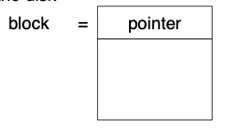

# 14 File System Implementation

## Contents

- File-System Structure &#x20;
- File-System Implementation &#x20;
- Directory Implementation &#x20;
- Allocation Methods &#x20;
- Free-Space Management &#x20;
- Efficiency and Performance &#x20;
- Recovery &#x20;
- NFS &#x20;
- Example: WAFL File System

### Objectives

- To describe the details of implementing local file systems and directory structures &#x20;
- To describe the implementation of remote file systems &#x20;
- To discuss block allocation and free-block algorithms and trade- &#x20;

  offs

## File-System Structure

- File structure
  - Logical storage unit 逻辑存储单元
  - Collection of related information 相关信息的收集
- File system resides on secondary storage (disks)
  - Provided user interface to storage, mapping logical to physical 提供存储用户界面，将逻辑映射到物理
  - Provides efficient and convenient access to disk by allowing data to be stored, located retrieved easily 通过允许存储数据、轻松检索来提供对磁盘的高效便捷访问
- Disk provides in-place rewrite and random access 磁盘提供就地重写和随机访问

I/O transfers performed in blocks of sectors (usually 512 bytes)

- File control block – storage structure consisting of information about a file
- Device driver controls the physical device 设备驱动程序控制物理设备
- File system organized into layers 文件系统组织成层

### File System Layers (Cont.)

Each with its own format (CD-ROM is ISO 9660; Unix has UFS, FFS; Windows has FAT, FAT32, NTFS as well as floppy, CD, DVD Blu-ray, Linux has more than 40 types, with extended file system ext2 and ext3 leading; plus distributed file systems, etc.)

## File-System Implementation

We have system calls at the API level, but how do we implement their functions? 我们在 API 级别有系统调用，但我们如何实现它们的功能？&#x20;

> On-disk and in-memory structures

**Boot control block** contains info needed by system to boot OS from that volume **启动控制块**包含系统从该卷启动操作系统所需的信息 &#x20;

> Needed if volume contains OS, usually first block of volume&#x20;

**Volume control block** **(superblock, master file table**) contains volume details 卷宗**控制块** **（超级块，主文件表**）包含卷详细信息

> Total # of blocks, # of free blocks, block size, free block pointers or array&#x20;

Directory structure organizes the files 目录结构组织文件

> Names and inode numbers, master file table

## Directory Implementation

## Allocation Methods

### Allocation Methods - Linked

**Linked allocation** – each file a linked list of blocks **链接分配** - 每个文件一个链接的块列表

- File ends at nil pointer 文件在零指针处结束
- No external fragmentation 没有外部碎片
- Each block contains pointer to next block
- No compaction, external fragmentation 无压实，外部碎片
- Free space management system called when new block needed 当需要新块时调用自由空间管理系统
- Improve efficiency by clustering blocks into groups but increases internal fragmentation 通过将块聚类为组来提高效率，但会增加内部碎片
- Reliability can be a problem 可靠性可能是一个问题
- Locating a block can take many I/Os and disk seeks 定位块可能需要许多 I/O 和磁盘查找

### FAT Variation

FAT (File Allocation Table 文件分配表) variation

- Beginning of volume has table, indexed by block number
- Much like a linked list, but faster on disk and cacheable
- New block allocation simple

Each file is a linked list of disk blocks: blocks may be scattered anywhere on the disk

## Free-Space Management

## Efficiency and Performance

## Recovery

## NFS

## Example: WAFL File System
